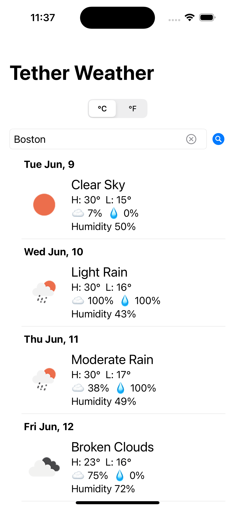
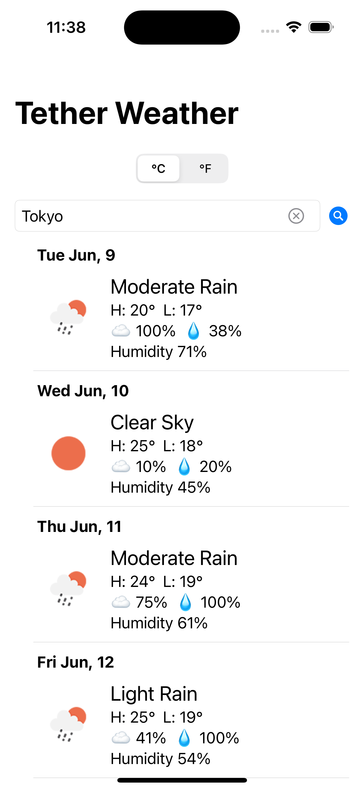
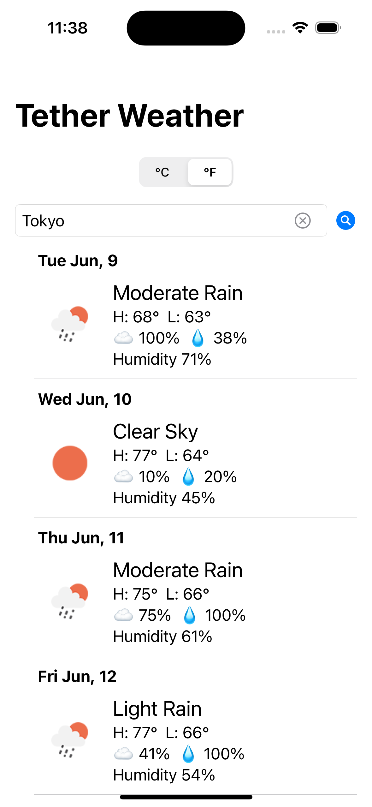

# Tether Weather

A SwiftUI iOS app that shows a 7-day weather forecast for any location using the [OpenWeatherMap One Call API 3.0](https://openweathermap.org/api/one-call-3). Built as a first step into iOS development — focused on networking, API integration, Swift concurrency, and a clean, responsive UI.

---

## Features

- **7-day forecast** — Daily high/low, conditions, humidity, cloud cover, and precipitation chance
- **Location search** — Enter a city or place; results are geocoded and used to fetch weather
- **GPS** — Tap the location button to fetch weather for your current location (reverse-geocoded to a city name)
- **°C / °F toggle** — Switch between Celsius and Fahrenheit; preference is saved
- **Last location** — Your last searched location is remembered and loaded on launch
- **Weather icons** — Condition icons loaded from OpenWeatherMap
- **Error handling** — Clear messages for geocoding failures, network issues, and missing API key

---

## Screenshots

| Boston — °C | Boston — °F | Tokyo — °C | Tokyo — °F |
|:-----------:|:-----------:|:----------:|:----------:|
|  |  |  |  |

---

## Tech Stack

| Layer | Technology |
|---|---|
| **UI** | SwiftUI (iOS 16+) |
| **Architecture** | MVVM, `@MainActor`, `async/await` |
| **Networking** | `URLSession` + `async throws`, OpenWeatherMap One Call API 3.0 |
| **Geocoding / GPS** | `CLGeocoder` + `CLLocationManager` (Core Location) |
| **Persistence** | `@AppStorage` for location and unit preference |
| **Images** | [SDWebImageSwiftUI](https://github.com/SDWebImage/SDWebImageSwiftUI) for async icon loading |

---

## Requirements

- **Xcode** 15+
- **iOS** 16.0+
- **OpenWeatherMap API key** — [Sign up](https://openweathermap.org/api) and subscribe to the One Call API 3.0

---

## Installation

### 1. Clone the repo

```bash
git clone https://github.com/SynsmyrF2001/Tether-Weather-App.git
cd Tether-Weather-App
```

### 2. Add your OpenWeatherMap API key

The API key is **not** committed to the repo. It is injected into the app's `Info.plist` at build time via a local xcconfig file.

1. Copy the example config:
   ```bash
   cp ApiKeys.xcconfig.example ApiKeys.xcconfig
   ```
2. Open `ApiKeys.xcconfig` and replace `YOUR_OPENWEATHERMAP_API_KEY` with your key.

`ApiKeys.xcconfig` is listed in `.gitignore` and will never be committed.

### 3. Open and run in Xcode

1. Open `Tether_iOS.xcodeproj` in Xcode.
2. Select a simulator or device and press **⌘R**.

Swift Package Manager resolves the SDWebImageSwiftUI dependency automatically when you open the project.

---

## Project Structure

```
Tether_iOS/
├── Tether_iOSApp.swift          # App entry point (@main)
├── ContentView.swift            # Main screen: search bar, GPS button, forecast cards
├── ForecastListViewModel.swift  # @MainActor ObservableObject: geocoding, GPS, API calls
├── ForecastViewModel.swift      # Per-day display logic, UnitSystem enum, Kelvin conversion
├── Forecast.swift               # Codable models mapping the API JSON response
└── API Service.swift            # Singleton APIService with generic async-throws getJSON
```

Config at repo root:

- `ApiKeys.xcconfig` — Your local API key (gitignored; create from `ApiKeys.xcconfig.example`)
- `ApiKeys.xcconfig.example` — Template showing required keys

---

## Architecture

### MVVM + Swift Concurrency

The app follows MVVM with Swift's structured concurrency throughout:

- **`ForecastListViewModel`** is annotated `@MainActor`, so all state mutations happen on the main thread without manual `DispatchQueue.main.async` calls. Public methods are `async`, keeping the call sites clean.
- **`APIService.getJSON`** is `async throws` — it uses `URLSession.data(from:)` and throws typed `APIError` cases (`invalidURL`, `badStatus`, `corruptData`), each conforming to `LocalizedError`.
- **`CLGeocoder`** doesn't have a native async API, so forward and reverse geocoding are wrapped in `withCheckedThrowingContinuation` to bridge into Swift concurrency cleanly.

### GPS Flow

`ForecastListViewModel` conforms to `CLLocationManagerDelegate`:

1. Tapping the GPS button calls `requestCurrentLocation()`.
2. If permission is undetermined, `requestWhenInUseAuthorization()` is called; the delegate's `locationManagerDidChangeAuthorization` fires on grant and immediately requests a one-shot location fix.
3. On `didUpdateLocations`, the coordinate is reverse-geocoded to a city name (updating the search field), then `fetchWeather(at:)` is called.
4. Delegate methods are marked `nonisolated` (required since the class is `@MainActor`); they hop back to the main actor via `Task { @MainActor in … }`.

### Unit Conversion

The `UnitSystem` enum (`.celsius` / `.fahrenheit`) replaces a raw `Int` flag. It is stored as a `RawRepresentable` `Int` in `@AppStorage("system")` for persistence. When the user toggles units, `ForecastListViewModel` propagates the new value to every `ForecastViewModel` in the list. Conversion happens in `ForecastViewModel.convert(temp:)`: subtract 273.15 from Kelvin for °C, then apply the standard formula for °F.

### UI

`ContentView` uses `@FocusState` to manage keyboard dismissal (replacing the old `UIApplication.shared.endEditing()` hack). The forecast list is a `LazyVStack` inside a `ScrollView` for full control over card styling — each row uses `.regularMaterial` with a `RoundedRectangle` clip for the frosted-glass card look.

---

## License

This project is for portfolio and learning purposes. OpenWeatherMap data is subject to [OpenWeatherMap's terms and conditions](https://openweathermap.org/terms).
